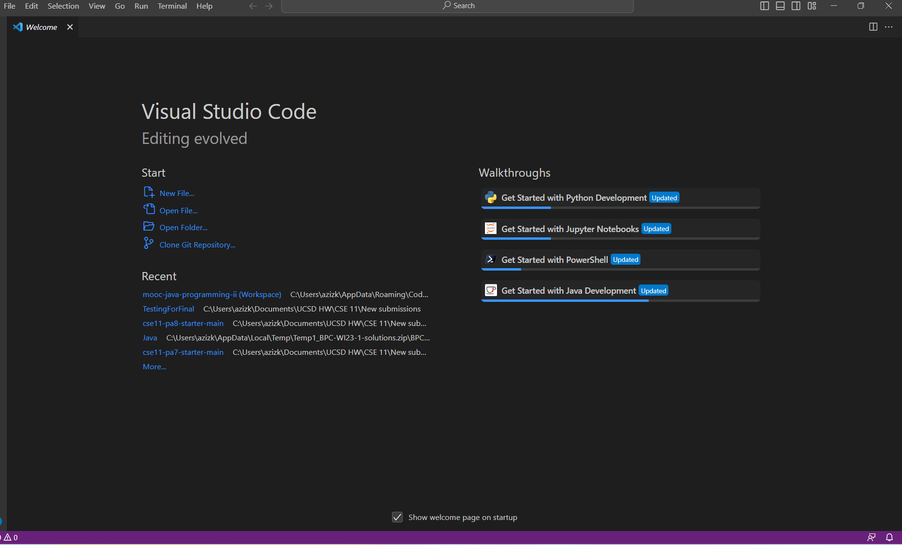
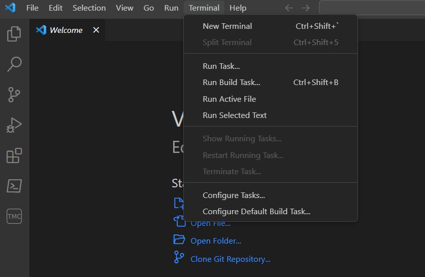
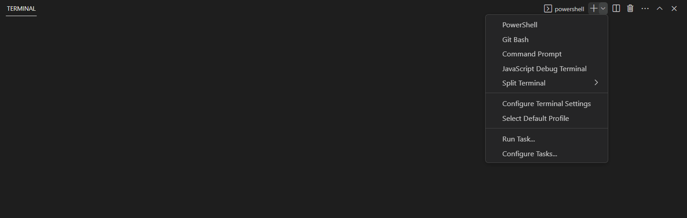
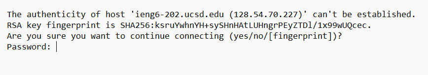

# Lab Report 1

Welcome, future me, to the realm of GitHub. It is I, you from the past who probably remembers most of the stuff you took on this lab. So, quick rundown of what we did:
1. Installed VS Code
2. Managed to remotely connect to my CSE 15L course-specific account
3. Tried out some cool command-line commands

Let's go through each one separately:

### Installing VSCode:
VSCode is the hub for all Computer Science learners; it is the most versatile IDE out there. To install it:
1. Go to this [link][id1]. It will take you to the Visual Studio website.
2. Once you get there, download the version that is compatible with your operating system. Basically, download Windows if you are on a Windows.
3. After you install VSCode, you should get sent to a page that looks like this: 
*Side note: it may look a bit different with the colors and such based on your settings*
>
4. Now you have VSCode installed! To start coding, you just have to install the necessary things for your specific language and you are **good to go!**


### Remote Connection to your course-specific account:
This one is a tough one, but it involves doing something you have seen a lot but never knew what it was: ```ssh```. The formal definition is:  
> SSH, also known as Secure Shell or Secure Socket Shell, is a network protocol that gives users, particularly system administrators, a secure way to access a computer over an unsecured network.

Basically this means that ```ssh``` is a way for you to remotely connect to another account securely. Makes you feel like Elliot from Mr Robot, right? *Good.*  
Let's break down how to use ```ssh```:
* To run this funtionality, you have to have a Linux system. But have no fear! You can use it on any operating system; all you need is to install Git. 
* Once that is done, all you need to do is to connect to your account through Git.

Here's how you download Git:
1. Go to the [Git website][id2] and choose the OS (operating system) you are using.
2. Download the Git installer and go with the default settings (unless you became a pro at this and know what the advanced settings do).

After you installed Git on your computer, the rest is a piece of cake. This is how you use Git in VSCode:
1. Open a new terminal like this:
>
2. On the top right corner of the terminal, a plus sign with a downward arrow will appear. Press on the arrow, and a dropdown menu will pop up. 
>
3. The last step is to pick Git Bash.

Now for the second half - connecting your account through Git:
1. Open up the bash terminal and type in this command:
```ssh cs15lsp23zz@ieng6.ucsd.edu```
>This command establishes the connection to your account, which in this case is your CS15L account
2. If you are connecting to your account from your computer for the first time, you will get a message like this:  
>  
>This just says that this is your first time logging in remotely to this account. Do you trust it?  
>For more info on the security of the login, check this [link][id3]


[id1]:https://code.visualstudio.com/
[id2]:https://git-scm.com/downloads
[id3]:https://superuser.com/questions/421074/ssh-the-authenticity-of-host-host-cant-be-established/421084#421084
