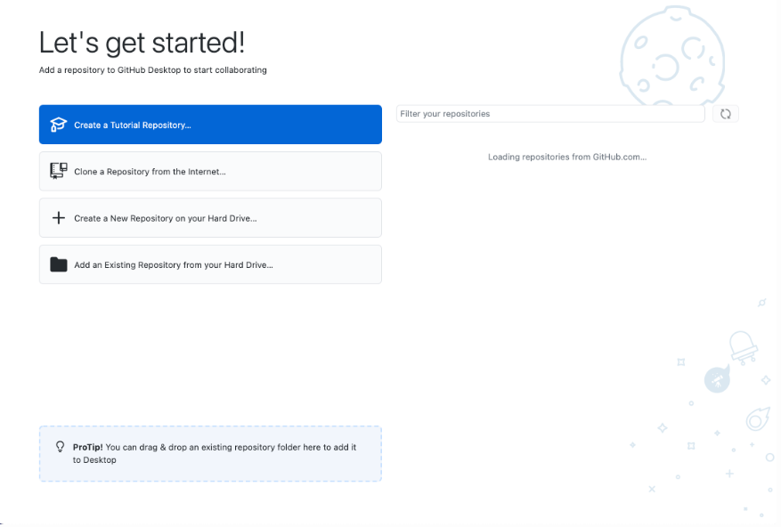

## Lab Report 2

Welcome back, me. I need no further introduction, but for reference, I am you from week 3 of spring quarter (off-character, I know). This week was really interesting, since it covered *quite* a few things that you will find interesting. Take a look:
- Joined a group! *Pretty chill ppl ngl*
- Got GitHub Desktop: Explanation of what that is comes below, but it IS something you were wondering how to do
- Used URLs in your code by implementing the URI interface
- Building and running your OWN SERVER!!!
- *Running* that server remotely
- Accessing URLs on the command line (pretty neat, am I right?)
- Debugging some weird looking code (and leaned some new terminology)

Yup that's a lot! So here's the breakdown:

### GitHub Desktop
So... This fancy little tool is why you have a GitHub account - other than the fact that you can use it to store all your coding projects. When you create a repository *a fancy word for project folder*, you will want to start writing your code and be able to share the project with your team members. So to do that you have to install GitHub Desktop.

Once you do that and open the app, you should face a page that looks like this:
> 

### Server stuff
Since the next few things are interrelated, it would me much easier to understand if they're all in one heading. So. You wanna make your own server? **WELL HERE YOU GOOOOO!** This is where things get suuper interesting:
First of all, the code you're gonna need is this:
>One to implement the URI (URL library) interface:
```
interface URLHandler {
      String processRequest(URI uri);
}
```
>And one to implement that interface in a method:
```
class Server {
      static void start(int port, URLHandler handler) { //method body. not really important for the idea to be understood }
}
```
Once that's done, here's how you build and run the server
>Remember, you are going to run this on your Git Bash, not on your powershell terminal
>
