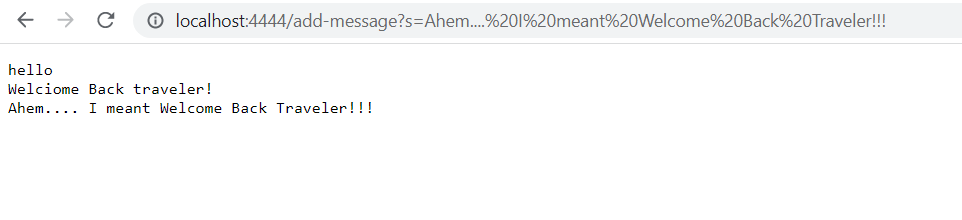
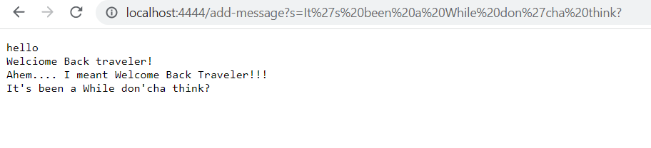
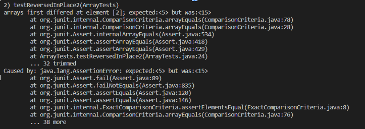

## Lab Report 2

Welcome back, me. I need no further introduction, but for reference, I am you from week 3 of spring quarter (off-character, I know). This week was really interesting, since it covered *quite* a few things that you will find interesting. Take a look:
- Joined a group! *Pretty chill ppl ngl*
- Got GitHub Desktop: Explanation of what that is comes below, but it IS something you were wondering how to do
- Used URLs in your code by implementing the URI interface
- Building and running your OWN SERVER!!!
- *Running* that server remotely
- Accessing URLs on the command line (pretty neat, am I right?)
- Debugging some weird looking code (and leaned some new terminology)

Yup that's a lot! So here's the breakdown:

### GitHub Desktop
So... This fancy little tool is why you have a GitHub account - other than the fact that you can use it to store all your coding projects. When you create a repository *a fancy word for project folder*, you will want to start writing your code and be able to share the project with your team members. So to do that you have to install GitHub Desktop.

Once you do that and open the app, you should face a page that looks like this:
> 

### Server stuff
Since the next few things are interrelated, it would me much easier to understand if they're all in one heading. So. You wanna make your own server? **WELL HERE YOU GOOOOO!** This is where things get suuper interesting:
First of all, the code you're gonna need is this:
>One to implement the URI (URL library) interface:
```
interface URLHandler {
      String processRequest(URI uri);
}
```
>And one to implement that interface in a method:
```
class Server {
      static void start(int port, URLHandler handler) { //method body. not really important for the idea to be understood }
}
```
Once that's done, here's how you build and run the server:
>*Remember, you are going to run this on your Git Bash, not on your powershell terminal*
>The best way to see a live example is to refer back to the code given to you in the wavelet fork you made.

Some definitions you might need:
> - Ports: The 4000 below identifies a specific port that the web server runs on. This is an extra part of a URL that’s often used in development; 4000 isn’t special and you could pick others – you’re welcome to try a few in the thousands.  
> - Localhost: The localhost domain refers to the computer you’re on. So rather than going out over the internet to send the URL to a particular domain somewhere else, this page is being handled by the running Java program on your computer, which we say is “listening” on localhost at port 4000. That work is what’s done in Server.java and by Java’s HTTPServer library.

1. Open the terminal, then compile and run the files that contain the general server class and your specific implementation of the class:
```
javac Server.java NumberServer.java 
java NumberServer 4000
```
2. Now you're live! Try refreshing the page a couple of times and test out the code in the wavelet file to see what happens!

Now to save your changes, you have to commit and push them, and this is how you do it:  
1. Open your GitHub Desktop window, and it should show that you have made a change in the ```wavelet``` respository. Click the button shown at the bottom left that says ```Commit to master```. 
2. Next, for the changes to actually appear on GitHub, you need to push them. GitHub Desktop should now display a new screen. Click the ```Push origin``` button on the page.

Running it on a remote server just needs one extra step before compiling, which is to log into your remote account and run this:
```git clone <your-repository-url-for-your-fork>```
Then compile and run the files. This result in the same page.

This all was for my reference, but the real stuff comes below:

## Part 1
WE MADE A SEARCH ENGINE! Well... kinda. It adds the text you put into the search bar and returns a message with *all the strings, including the previously typed ones.*

Here's the output: 
> 
> 

- For both the images, the code run was the same since the file is the same. What essentially happened was that the server you created was "listening" for the request you made, which is "add-message". After the program understood the request, it took everything that occured after the question mark as the *query*, which is what we want to add and some extra. We removed the unnecessary "s=" and added it to a String, which we then outputted to the website.
- In code, the methods that were called were part of the handler class:
```
/**
 * This class will take the url and check the path (the command it wants to do)
 * and handle the request appropriately.
 */
class StringHandler implements URLHandler{
    String message = "";

    public String handleRequest(URI url){
        if(url.getPath().equals("/add-message")){
            String[] queryFromLink = url.getQuery().split("=");
            String toAddToMsg = queryFromLink[1];
            message += toAddToMsg;
            message += "\n";
        }
        return message;
    }
}
```
- This is the "head" method being run by the code. The "head" method itself has a lot of inner code running it, so for a fuller view check ```StringSearch.java```
- For this class all we needed was the URL of the website we wanted. After getting the request and making sure it is ```/add-message```, we added the rest of the URL to the String.
- No values will change from this implementation since the text that comes after the equals sign will be dealt with as a String, so any integer, URL, or other types will be dealt with as a String.

## Part 2
Cool. Now then, let's squash some BUGS:
Here's a bug from week 3's lab:
```
static void reverseInPlace(int[] arr) {
    for(int i = 0; i < arr.length; i += 1) {
      arr[i] = arr[arr.length - i - 1];
    }
}
```

When you first run this, you won't see an issue. Here's a demonstration:
```
   @Test 
   public void testReverseInPlace() {
    int[] input1 = { 3 };
    ArrayExamples.reverseInPlace(input1);
    assertArrayEquals(new int[]{ 3 }, input1);
    }
```
This test will not output an error, so it seems that there is no issue with our code.

However, this bug will show when testing it with the proper code. Thankfully, JUnit came to the rescue:
```
  @Test
  public void testReversedInPlace2(){
    int[] numbers = {5, 10, 15};
    ArrayExamples.reverseInPlace(numbers);
    int[] reversedNumbers = {15, 10, 5};
    assertArrayEquals(reversedNumbers, numbers);
  }
  ```
  This test will output an error, saying that the last element is not what it should be:
  > 

So the symptom was that it wasn't correctly adding all the elements for arrays that are longer than 1.  
This is what it looked like before the fix:
```
static void reverseInPlace(int[] arr) {
    for(int i = 0; i < arr.length; i += 1) {
      arr[i] = arr[arr.length - i - 1];
    }
}
```

A fix for this issue can look like:
```
static void reverseInPlace(int[] arr) {
      for(int i = 0; i < arr.length / 2; i++) {
        int temp = arr[i];
        arr[i] = arr[arr.length - i - 1];
        arr[arr.length - i - 1] = temp;
      }
}
```
This fix now added all the elements, including the last one, correctly to the array.

## Part 3
Well I guess that my reference was not for naught! The documentation before Part 1 serves as all the things I have learned from week 2 and week 3.
