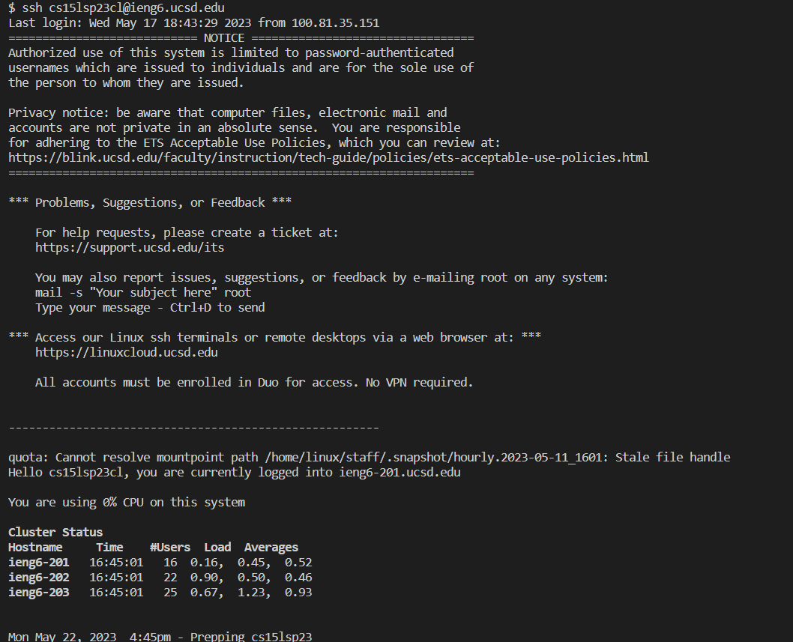
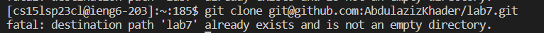
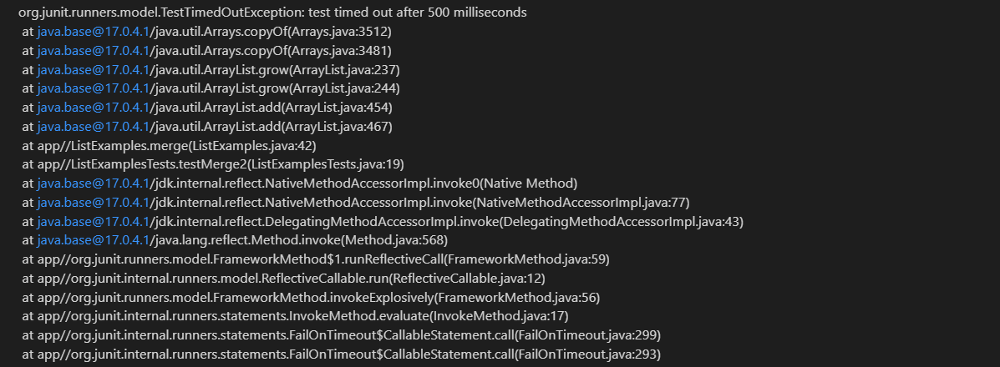

## Lab Report 4
Welcome back soldier.
This week, you learned a lot about ```vim```, which is a very efficient text editor that allows you to do everything from the editor, including navigation. Most of the stuff you learned are commands, and they all are on the worksheets, so it would be a bit redundant to rewrite them here.
Anywho, let's get to the parts:

### Part 1
We are gonna walk through steps 4-9 in the Baseline task of week 7:
1. *Keys inputted:* ```ssh cs15lsp23cl@ieng6.ucsd.edu <enter>```. This is just standard remote logging into an account.

2. *Keys inputted:* ``` git clone git@github.com:AbdulazizKhader/lab7.git <enter>```. This is a git command to clone the repository from my GitHub account into the ieng6 account. You probably have done this before in lab, so the output will look something like this:

This just means that there is a directory with that name that already exists, which means that you have already cloned it at some point.
3. *Keys inputted:* ``` cd lab7/ <enter> bash test.sh <enter>```: Since you were not in the correct directory, you had to move to lab7, then you can run the bash script that contains the tests. This should give you an error with an unedited file, which will look something like this: 

4. Now's the fun part: you fix this *in vim*:
- *Keys pressed:* ``` vim List <tab> .java <enter>```. This autocompleted the file name so I can enter vim without any fear of typos.
- *Keys pressed:* ```<shift + g> k k k k k k e ```. This took me to the end of the file then I went up 6 times. After that I went to the end of the first word. 
- *Keys pressed:* ```x i 2 <esc>```. This removed the last character of the word, then took me to insert mode to edit the file correctly. After changing index1 to index2, I went back to normal mode.
- *Keys pressed:* ```: w q <enter>```. This saves my changes and then quits vim.


