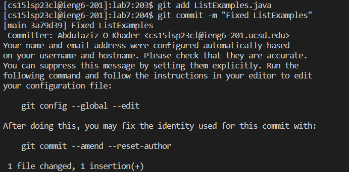

## Lab Report 4
Welcome back soldier.
This week, you learned a lot about ```vim```, which is a very efficient text editor that allows you to do everything from the editor, including navigation. Most of the stuff you learned are commands, and they all are on the worksheets, so it would be a bit redundant to rewrite them here.
Anywho, let's get to the parts:

### Part 1
We are gonna walk through steps 4-9 in the Baseline task of week 7:
1. *Keys inputted:* ```ssh cs15lsp23cl@ieng6.ucsd.edu <enter>```. This is just standard remote logging into an account.
> 
2. *Keys inputted:* ``` git clone git@github.com:AbdulazizKhader/lab7.git <enter>```. This is a git command to clone the repository from my GitHub account into the ieng6 account. You probably have done this before in lab, so the output will look something like this:
> 
This just means that there is a directory with that name that already exists, which means that you have already cloned it at some point.
3. *Keys inputted:* ``` cd lab7/ <enter> bash test.sh <enter>```: Since you were not in the correct directory, you had to move to lab7, then you can run the bash script that contains the tests. This should give you an error with an unedited file, which will look something like this: 
> 
4. Now's the fun part: you fix this *in vim*:
- *Keys pressed:* ``` vim List <tab> .java <enter>```. This autocompleted the file name so I can enter vim without any fear of typos.
> 
- *Keys pressed:* ```<shift + g> k k k k k k e ```. This took me to the end of the file then I went up 6 times. After that I went to the end of the first word. 
- *Keys pressed:* ```x i 2 <esc>```. This removed the last character of the word, then took me to insert mode to edit the file correctly. After changing index1 to index2, I went back to normal mode.
- *Keys pressed:* ```: w q <enter>```. This saves my changes and then quits vim.
5. *Keys pressed:* ```bash test.sh```. Now you check the test again and see that it passes both tests:
> 
6. This last step requires more work since you don't have access to GitHub yet, so you have to give it access:
- This first part is to create keys for your ieng6 account:
- *Keys pressed:* ```ssh-keygen <enter> <enter> <enter> ```. This created a key for your ieng6 account.
- *Keys pressed:* ```ssh cs15sp23cl@ieng6.ucsd.edu <enter> mkdir .ssh <enter>```. This logged you into your ieng6 account and created a directory called .ssh, which will store the key.
- *Keys pressed:* ```scp /Users/azizk/.ssh/id_rsa.pub cs15lsp23cl@ieng6.ucsd.edu:~/.ssh/authorized_keys```. This takes a copy of the key you saved on your local computer and stores it on your remote account.
- This is now the last time you have to put in your password!
- After that you plug that key you generated into GitHub:
- Relogin to your remote account if you logged out, which is done by ```ssh cs15lsp23cl@ieng6.ucsd.edu <enter>```.
- *Keys pressed:* ```ssh-keygen <enter> <enter> <enter> ```. This will open the random key art that came with your key generation.
- *Keys pressed:* ``` cat .ssh/id_rsa```. This will print out the 256-bit RSA key that you made. It will look something like this:
> 
- The next few steps are done on GitHub, so open it and go to Settings by clicking your avatar. Then open the SSH and GPG tab.
- Press ```New SSH Key```. Copy the key you got in your terminal and paste it in the box provided, and give the key a title so you know which account this responds to.
- Run the following command to add Github.com as a recognized host (this avoids the scary yes/no prompt about accepting new connections the first time you connect): *These are the keys pressed as well*```ssh-keyscan -t rsa github.com >> ~/.ssh/known_hosts```
- Check your connection using ```ssh -T git@github.com```. This will output something along the lines of "You’ve successfully authenticated, but GitHub does not provide shell access."
And now you're done! You've successfully linked your ieng6 account with your GitHub account, so that leaves one last step:
7. *Keys pressed:* ```git add ListExamples.java <enter>```. This gets the file ready for committing and pushing.
8. *Keys pressed:* ```git commit -m "Fixed ListExamples" ```. This commits the change with a small message describing it.
> 
9. *Keys pressed:* ```git push origin main```. This pushes the change into the origin, which is your GitHub link, and into the main branch.
