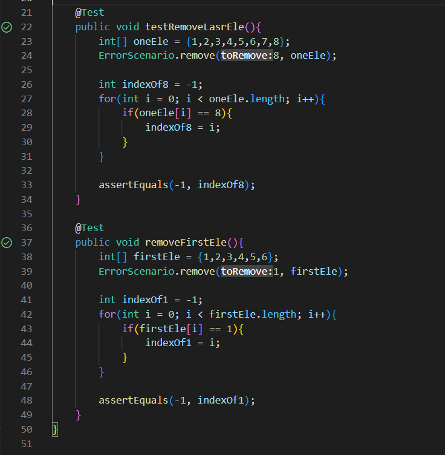

## Lab Report 5
There isn't much we did to catch up on, but you did have fun doing Kahoot this week! Now onto the bane of all software engineers: the report.

### Part 1
**What environment are you using (computer, operating system, web browser, terminal/editor, and so on)?**  
Windows

**Detail the symptom you're seeing. Be specific; include both what you're seeing and what you expected to see instead. Screenshots are great, copy-pasted terminal output is also great. Avoid saying “it doesn't work”.**
I am creating a method to remove an element from an array. It manages to successfully remove the elements at various indexes, but fails to remove the element at the last index. It also fails to remove the first element as well.
> 
> 


**Detail the failure-inducing input and context. That might mean any or all of the command you're running, a test case, command-line arguments, working directory, even the last few commands you ran. Do your best to provide as much context as you can.**
The first input was an integer array of length 6, and the second input was an integer array of length 8. In both cases, the elements are non-zero inputs. The code it ran on was the following:
```
public class ErrorScenario {
    static void remove(int toRemove, int[] arr){
        if(arr == null){
            return;
        }

        for(int i = 0; i < arr.length - 1; i++){
            if(arr[i] == toRemove){
                arr[i] = arr[0];
            }
        }
    }
}
```
And the bash script was the following:
```
javac -cp ".;lib/hamcrest-core-1.3.jar;lib/junit-4.13.2.jar" *.java
java -cp ".;lib/junit-4.13.2.jar;lib/hamcrest-core-1.3.jar" org.junit.runner.JUnitCore ErrorScenarioTest
```

**The TA would respond with:**
- Could you change the for loop from ```arr.length - 1``` to ```arr.length```? This will make it go to the end of the loop.
- Change the code inside the if statement from ```arr[i] = arr[0]``` to ```arr[i] = 0``` since none of the elements are zero.

The final product after changing would look like:
```
public class ErrorScenario {
    static void remove(int toRemove, int[] arr){
        if(arr == null){
            return;
        }

        for(int i = 0; i < arr.length; i++){
            if(arr[i] == toRemove){
                arr[i] = 0;
            }
        }
    }
}
```
This would pass all the tests:
> 

### Part 2
The most interesting thing you have learned by a landslide was learning about vim. It felt like you were recreating the matrix using primitive devices, and it makes you look like a professional programmer (my new CS Rizz technique?). The different modes you can go into, and the fact that you don't even need a mouse at this point, makes it a really fun topic to learn about. I personally enjoyed working in visual mode and finding new one-character commands in vim, and will definitely use that more in the future.
